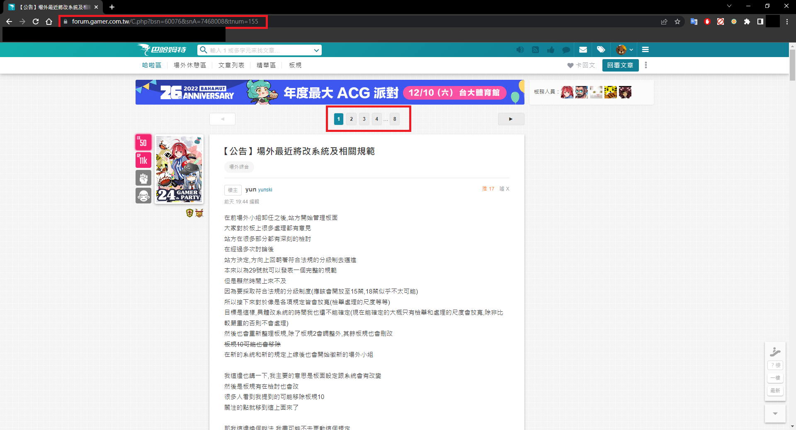

如何安裝

Chrome>設定>擴充功能>開發人員模式>載入未封裝項目

Chrome>setting>Extensions>Developer mode>Load unpacked

如何使用

請在文章頁面再進行抽選

注意!頁數越多會跑越久!只有1頁會跑很快

每頁有20樓

2頁已上每頁會跑3秒，如圖8頁(160樓)就會跑24秒

超過50頁(1000樓)每頁會跑8秒 耗費 400秒

目的是減輕伺服器負擔跟保護你IP

請自行取捨 有需求可以自行改delay秒數

篩選出來是不重複的ID

輸入人數後開始抽選

注意!有可能重複抽取跟抽到樓主，請自行判斷

